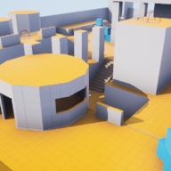

# Electric Shooter 
C++ Online Third Person Shooter Template - Unreal Engine 4
Game made in 2017 using Unreal Engine 4.17 and 4.20

Author: 
 - Juan Belón (juaxix) 
  

## Relevant links
- Watch a [gameplay video](https://youtu.be/xBcP8Def0r8)

- Download a compiled version for windows: [here](https://www.dropbox.com/s/2049vmgyjrfmvxa/ElectricShooter.zip?dl=0)
 

## Instructions for the game
- Basic movement using WASD
- Mouse wheel to change the current weapon
- Mouse left click to shoot
- Mouse right click to aim
- SPACE to jump
- ESCAPE to exit the game

## About this project
This project implements a traditional multiplayer TPS with AI algorithms made with Unreal.
There are two types of enemies:
- Small-Robots: using physics, they will try to explode near you
- Humanoids: smarter than small-robots, they will find and shoot you, they will hide when necessary.

Notes: You need to enable in your Editor Preferences:
- "Environment Querying System"
